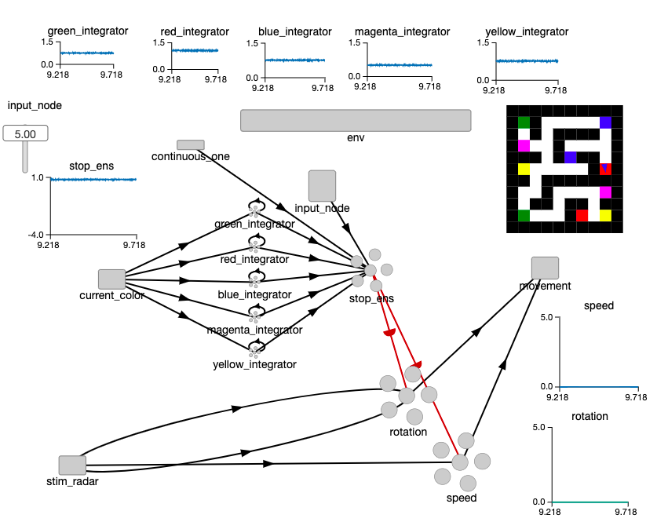

# Cognitive Robotics Project
Course Project for Cognitive Robotics

## Requirements
To run the program, make sure you have installed the dependencies listed in environment.yml. 
We recommend creating a conda environment for every project. You can do this with the following command:
`conda env create --file environment.yml`

## Usage
Run nengo in the directory of this repository. Select one of the four agents:
* color_critter_ensemble.py
* color_critter_implausible.py
* color_critter_naive.py
* color_critter_spa.py

Of these, color_critter_ensemble works best in the environments that were tried.

To change the environment, change the map parameter in the grid.World call within the color_critter file you chose.
